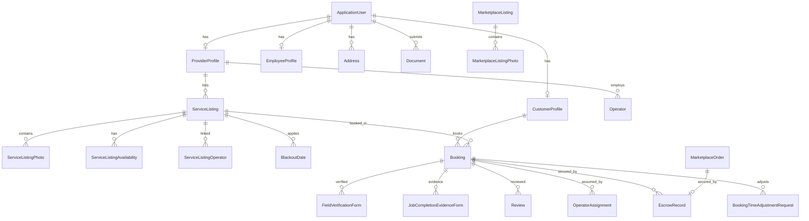

# Database Schema & Entity Relationships

The relational model is persisted in Microsoft SQL Server using Entity Framework Core.

## Entity-Relationship Diagram (ERD)

## Cascade Behaviors & Database Indexes
- **Unique Indexes**:
  - `UX_EscrowRecords_BookingId`: Restricts one escrow record per booking.
  - `UX_TimeAdj_BookingId_Pending`: Restricts a booking to only one active, pending time adjustment at a time.
  - `UX_Conversations_ServiceListing_Participants`: Guarantees a unique 1-to-1 conversation track per listing between interested buyers and listings.
- **Cascade Deletes**:
  - Deleting a `ServiceListing` deletes its constituent `ServiceListingPhotos` and `ServiceListingAvailability`.
  - Relationships involving critical profiles like `CustomerProfile` or `ProviderProfile` are configured with restrict deletions to preserve transaction audit logs.
- **Spatial Data**:
  - Spatial indexing is applied on geographic coordinates (`ProviderProfiles.ServiceZoneCenter` and `Bookings.ServiceLocationGeo`) to ensure low latency spatial grid scans.
