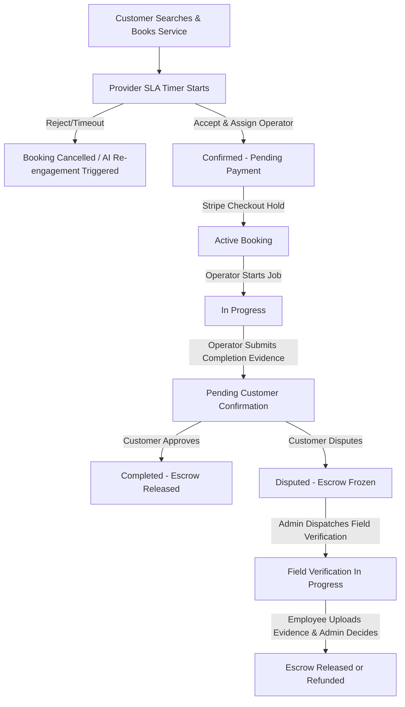

# Project Overview: HEVEQ Heavy Equipment Marketplace

HEVEQ is a comprehensive digital marketplace and scheduling platform for heavy equipment services and product sales. The platform acts as a multi-sided ecosystem connecting **Equipment Providers**, **Customers**, **Operators/Employees**, and **Administrators** to facilitate transparent, secure, and verified operations.

## Main Purpose
The system addresses standard trust, verification, and efficiency challenges in the heavy equipment rental and sales industries. It ensures secure transaction cycles via an Escrow system, physical dispute resolution using dispatched Field Verifications, and intelligent semantic discovery via vector search databases.

## Target Users
- **Customers**: Contractors, project managers, or individuals looking to book heavy equipment services or purchase heavy machinery/parts.
- **Providers**: Rental companies or equipment owners listing services or equipment for lease/sale.
- **Employees**: Heavy equipment operators assigned to bookings, and field verification agents dispatched to resolve disputes.
- **Administrators**: Platform managers overseeing user verification, document review, and dispute mediation.

## User Roles
| Role | Business Meaning |
| :--- | :--- |
| **Customer** | Registers, creates bookings, pays for services, buys marketplace products, and files disputes if needed. |
| **Provider** | Lists service listings, configures blackout dates/calendars, assigns operators, processes payouts, and lists marketplace products. |
| **Employee** | Represents platform operators or field personnel who receive assignments, submit job completion evidence, or perform physical site verification. |
| **Admin** | Manages system configurations, reviews provider registration documents, decides on disputes, and runs vector reindexing. |

## Main Modules
1. **Service Listing & Catalog Management**: Allows providers to list construction/industrial equipment services with hourly rates, location parameters, and daily schedules.
2. **Booking & SLA Lifecycle**: Handles real-time bookings from creation, provider acceptance (SLA), stripe payment hold, job execution, and operator assignment.
3. **Marketplace Catalog & Orders**: Facilitates direct sales of machinery, parts, or accessories under escrow control.
4. **Escrow & Payments System**: Integrates Stripe checkout and payment captures to secure funds between customers and providers, automating platform commission and VAT deductions.
5. **Support Ticket & Dispute System**: Supports general tickets and escrow disputes. Integrates field verification dispatches where employees upload physical evidence.
6. **AI Semantic Search**: Powers query expansion and listing discovery using Qdrant Vector Search.
7. **Real-time Messaging**: Handles live updates, notifications, and chat communications via SignalR.

## Complete Business Workflow

### Service Booking Lifecycle

### Marketplace Purchase Lifecycle
1. **Listing**: Provider lists a product in the marketplace.
2. **Order**: Customer places an order, transferring funds to Escrow.
3. **Fulfillment**: Provider ships the equipment.
4. **Auto-Confirm**: If the customer doesn't confirm delivery, a Hangfire job automatically completes the order after a specific SLA period, releasing funds.

## High-Level Architecture
The project is built on ASP.NET Core using **Clean Architecture** principles:
- **Presentation (HEVEQ.Api)**: Exposes REST APIs, holds SignalR hubs, and runs global exception middleware.
- **Application (HEVEQ.Application)**: Orchestrates CQRS features (MediatR), pipelines, validators (FluentValidation), and DTO definitions.
- **Domain (HEVEQ.Domain)**: Houses core entities, enums, aggregate roots, and domain constants.
- **Infrastructure (HEVEQ.Infrastructure)**: Implements database persistence (EF Core), Stripe integration, Qdrant vector sync, and Hangfire background schedulers.
